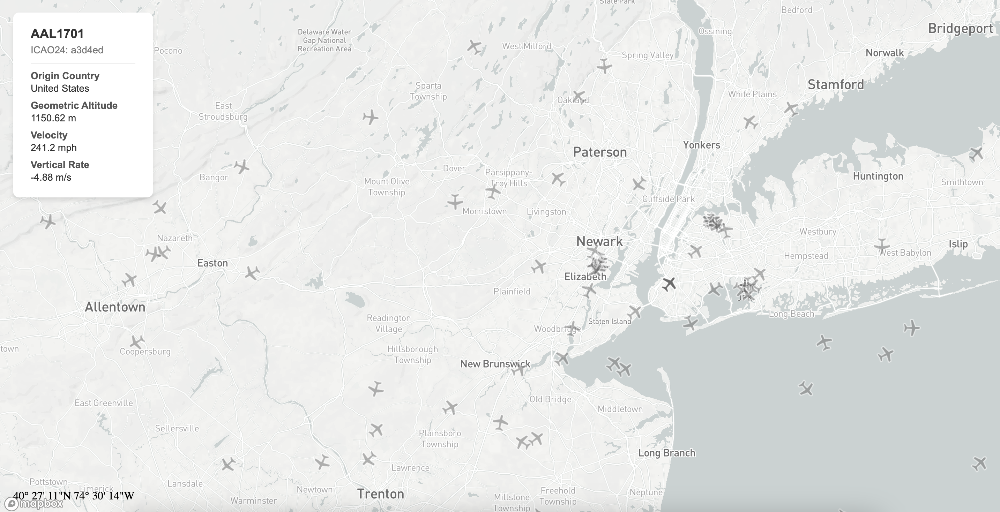
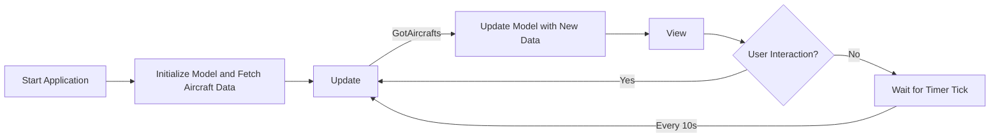

# Elm Live Flight Tracker

A real-time flight tracking web app built with [Elm](https://elm-lang.org/) and [Mapbox](https://www.mapbox.com/), utilizing the [OpenSky Network API](https://openskynetwork.github.io/opensky-api/rest.html) to display live aircraft positions on an interactive map.

Live demo: [here](https://waley-z.github.io/elm-live-flight-tracker-map/)



## Introduction

Elm Live Flight Tracker is a web application that visualizes live aircraft data from the OpenSky Network API on an interactive Mapbox map. It demonstrates the power of functional programming with Elm by efficiently handling real-time data updates, user interactions, and rendering complex UI components.

This project was developed by Hongxiao Zheng and Max Lan for [COSC 59: Principles of Programming Languages](https://cosc59.gitlab.io/) in Fall 2024.

## Features

- **Real-time Flight Data**: Fetches live aircraft positions every 10 seconds from the OpenSky Network API.
- **Interactive Map**: Displays aircraft positions on a Mapbox GL JS map using the `elm-mapbox` library.
- **Aircraft Details**: Click on an aircraft symbol to view detailed information.
- **Dynamic Map Styling**: Uses predefined Mapbox styles and layers to render the map and aircraft symbols.
- **Smooth Animations**: Utilizes Mapbox commands provided by the `elm-mapbox` library to provide a seamless user experience.

## Why Elm?

Elm is a purely functional programming language that compiles to JavaScript, designed for building reliable and maintainable web applications. By using Elm for this project, we benefit from:

- **No Runtime Exceptions**: Elm's compiler catches errors at compile time, ensuring a smooth user experience without crashes or unexpected behaviors.
- **Functional Paradigm**: Enables clear and concise code, making it easier to reason about complex UI logic, asynchronous data fetching, and state management.
- **Immutable Data Structures**: Simplifies handling real-time data updates without side effects, making code more predictable and easier to debug.
- **Strong Static Type System**: Provides type safety, reducing bugs and improving code quality. JSON decoding, a common source of runtime errors, is handled reliably with Elm's type system.
- **Great Performance**: Elm applications are optimized for speed and efficiency, providing a responsive user interface even when handling real-time data updates.
- **Powerful Tooling**: Elm's compiler provides helpful error messages, and the ecosystem includes tools that streamline development.

This project leverages Elm's strengths to manage:

- **Asynchronous Data Fetching**: Using Elm's `Http` module to fetch data from the OpenSky Network API.
- **JSON Decoding**: Safely parsing complex JSON data structures with Elm's `Json.Decode` module.
- **State Management**: Using Elm's `Model` and `update` architecture to manage application state in a predictable way.
- **User Interaction**: Handling events such as mouse hover and clicks on map features.
- **Integration with JavaScript Libraries**: Utilizing `elm-mapbox` to integrate Mapbox GL JS into an Elm application.

## Architecture

The Elm Live Flight Tracker is designed following the Elm Architecture, which consists of three core parts: **Model**, **View**, and **Update**. Below is an explanation of how these components interact to create the application's workflow.



- **Initialization**

  - **Application Start**: When the application loads, it initializes the `Model` with default values and sends an HTTP request to fetch aircraft data from the OpenSky Network API.
  - **Initial Model State**:
    - `position`: User's current position on the map.
    - `aircrafts`: An empty list that will hold aircraft data.
    - `selectedAircraft`: `Nothing` initially; will hold data of the selected aircraft upon user interaction.
    - `selectedFeatureId`: `Nothing` initially; will track the ID of the selected map feature.

- **Fetching Aircraft Data**

  - **HTTP Request**: The application sends a GET request to the OpenSky Network API to retrieve the current state of all aircraft.
  - **JSON Decoding**: Upon receiving a response, the application uses Elm's `Json.Decode` module to parse the JSON data into Elm types safely.

- **Updating the Model**

  - **Message Handling**: The `update` function handles the `GotAircrafts` message, which contains the result of the HTTP request. If the data is successfully fetched and decoded, the `Model` is updated with the new list of aircraft.

- **Rendering the View**

  - **Map Rendering**: The `view` function constructs the HTML to display the interactive map and any selected aircraft details.
  - **Aircraft Display**: Aircraft are displayed on the map using Mapbox layers and symbols. The positions are updated based on the latest data in the `Model`.

- **User Interaction**

  - **Hover Events**: When the user hovers over an aircraft symbol, the application captures the event and updates the `Model` to reflect the current position.
  - **Click Events**: Clicking on an aircraft symbol selects it, updating the `selectedAircraft` in the `Model`, which triggers the view to display detailed information.
  - **Event Handling**: These interactions generate messages (`Hover`, `Click`) that the `update` function handles to update the `Model`.

- **Periodic Data Updates**

  - **Timer Subscription**: The application uses Elm's `Time.every` function to set up a subscription that triggers a `Tick` message every 10 seconds.
  - **Refreshing Data**: The `update` function handles the `Tick` message by fetching new aircraft data, repeating the cycle.

## Installation

### Prerequisites

- [Node.js](https://nodejs.org/) (version 16 or higher)
- [Elm](https://guide.elm-lang.org/install/elm.html) (version 0.19.1)
- A Mapbox access token

### Steps

1. **Clone the repository**

   ```bash
   git clone https://github.com/Waley-Z/elm-live-flight-tracker-map
   cd elm-live-flight-tracker
   ```

2. **Install npm dependencies**

   ```bash
   npm install
   ```

3. **Configure Mapbox Access Token**

   Update the Mapbox access token in your `index.html` file or wherever the token is specified in the code:

   ```html
   <script>
     elmMapbox.registerCustomElement({ token: "YOUR_MAPBOX_ACCESS_TOKEN" });
     // ...
   </script>
   ```

   Replace `YOUR_MAPBOX_ACCESS_TOKEN` with your actual Mapbox token.

4. **Build the Elm application**

   ```bash
   elm make src/Main.elm --output=main.js
   ```

5. **Open static files in a browser**

   Open the `index.html` file in your browser to view the application.

## Usage

Once the application is running, you'll see a world map displaying live aircraft positions.

- **Hover over aircraft**: See the aircraft's position displayed at the bottom left corner.
- **Click on an aircraft**: View detailed information about the flight in an info panel on the upper left corner.
- **Map Interactions**: Zoom in/out and pan around the map to explore different regions.

Notice that there is a [limitation](https://openskynetwork.github.io/opensky-api/rest.html#limitations) on the OpenSky Network API requests. The API will return 429 when the limit is reached.
